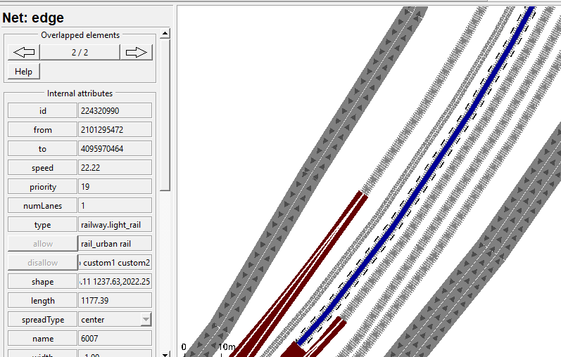

# RailSumo

+++ ACHIEVEMENT +++ 

Why SUMO : 
- Mature research platform 
- Open and Extensible
- Powerful toolbox for creating, running, analyzing simulations
- Run-time interaction with user code
- Active global user community
- Used world-wide, especially in the scientific community

SUMO – Applications :

- Planning and evaluation / assessment
- Traffic management 
- Infrastructure changes
- Public transport
- New technologies (e.g. vehicular communication, automated transport systems)
- Optimization
- Traffic lights
- Routing
- Traffic forecast (short-term mostly)
- Data fusion for traffic surveillance

Public transport in SUMO :

- Import of public transport data from OpenStreetMap
- Automation support for network correction
- Heuristic completion of missing schedule data
- Computing itineraries

Transport Network Tools : 

How to chance and rebuild the scenario :

Building a train scenario :

 - Tracks: 
 
 
 
 

 - Vehicle :

 - Simulation :
 
 

 - Signals :
 
 
 
 
 
 

 - Stations :

Using Reinforcement Learning for Simulation of Urban Mobility :

- Simulation of Urban Mobility (or SUMO for short) is an open source, microscopic, multimodal traffic simulator. It allows the user to simulate how a specified traffic demand performs on a given road network. SUMO is an excellent choice for urban traffic simulation as it is able to perform an optimised traffic distribution method based on vehicle type or driver behaviour. It is also able to update the vehicle’s route if there is any congestion or if an accident occurs, finding the best routing option to enhance urban sustainability and resilience. It also supports Traffic Control Interface (TraCI for short), which is a Python API that treats the SUMO simulation as a server and allows the user to gather data from a traffic simulation or modify the simulation. This makes TraCI a perfect tool for performing Reinforcement Learning in the SUMO simulator.

- The optimisation of urban transport networks through the use of artificial intelligence, the combination of Reinforcement Learning and a neural network will allow for a better understanding of the transport network, leading to better traffic management. This in turn will minimise the total travel time of every driver within the urban transport network, leading to a decrease in fuel consumption and a reduction in carbon emissions.

Why reinforcement learning :

- Reinforcement learning as a machine learning technique has led to very promising results as a solution for complex systems. A reinforcement learning method is able to gain knowledge or improve the performance by interacting with the environment itself. The theory of reinforcement learning is inspired by behavioural psychology, it gains reward after taking certain actions under a policy in an environment. The goal of reinforcement learning is to learn an optimal policy based on the reward obtained by repeating the interaction with the environment. This consistently optimises the policy and eventually creates a solution.

Interfacing  with traCI : 

-	TraCI could be accessed using multiple programming languages, with the most common language being Python. The package tools/TraCl in the SUMO simulator allows users to interact with SUMO using Python. This is advantageous as Python is already a well established script language for machine learning, providing useful libraries (such as Numpy and Pandas) whilst implementing a machine learning algorithm.

-	With this interfacing we can do a lot of things like : V2X , platooning , smart management , smart traffic management, smart emergency . 
-	And we can also create an electric vehicle and stations of charging the vehicle on the road.
